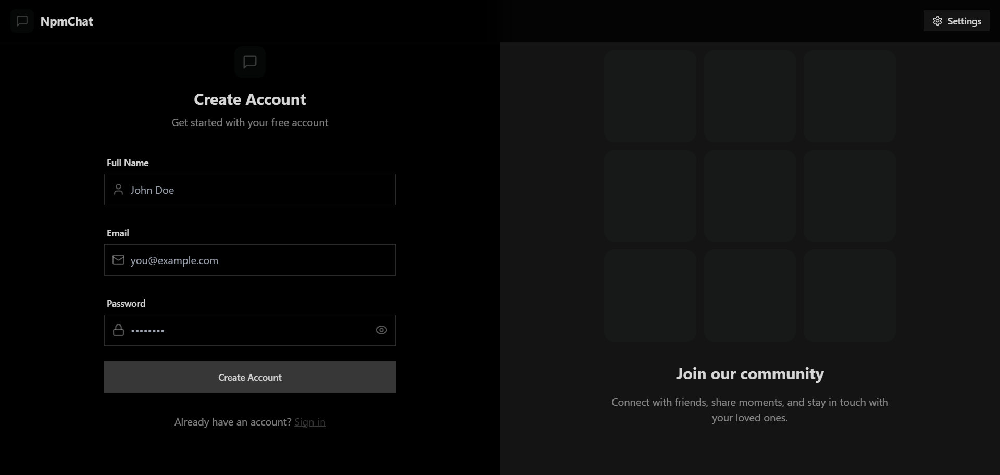
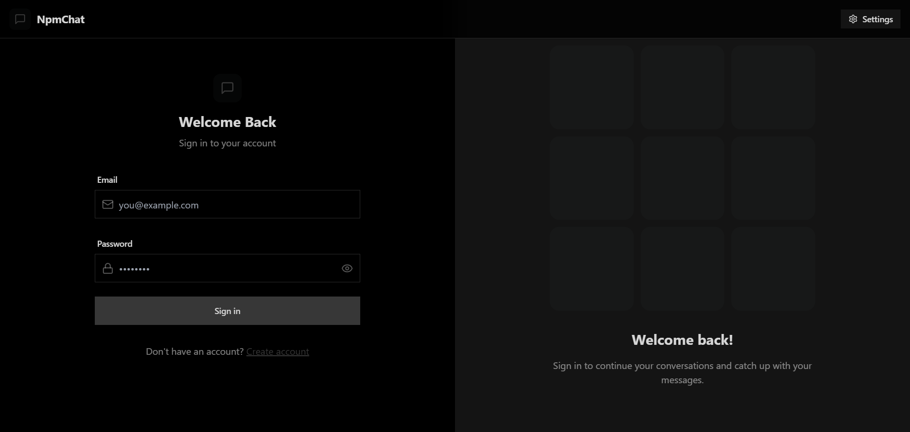
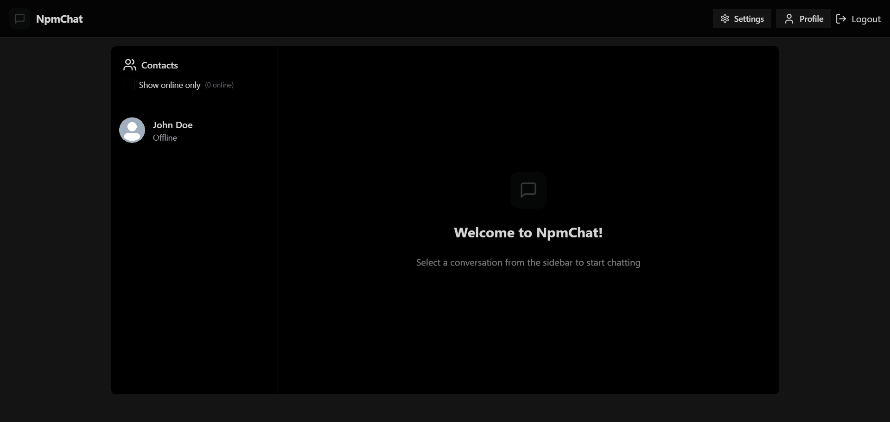
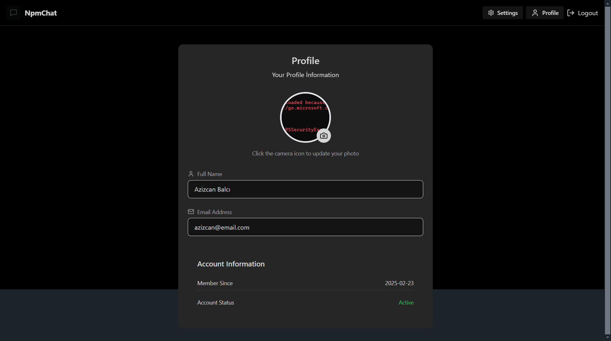
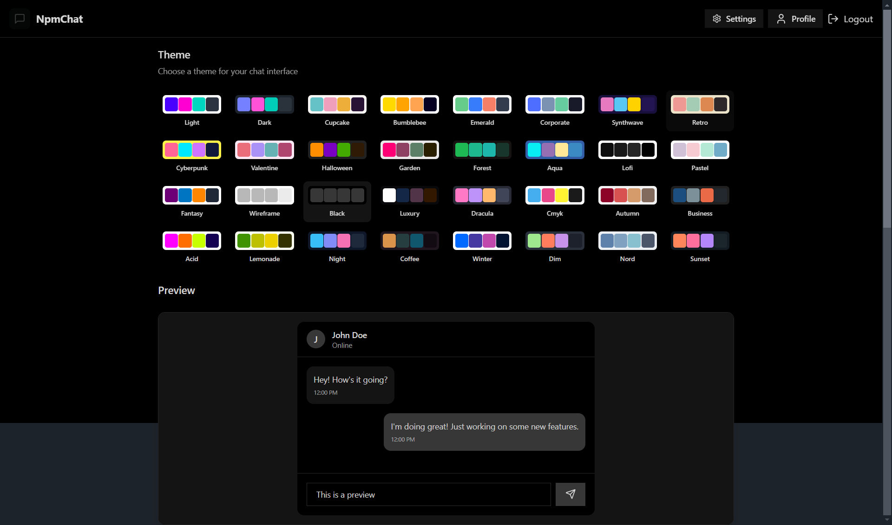

# CHAT-APP

## Ekran Görüntüsü







CHAT-APP, gerçek zamanlı iletişim ihtiyaçlarını karşılamak üzere geliştirilmiş modern bir sohbet uygulamasıdır. Kullanıcı dostu arayüzü ve güçlü altyapısıyla, anlık mesajlaşma deneyimini en üst seviyeye taşır.

## Özellikler

- 📡 **Gerçek Zamanlı Mesajlaşma:** Kullanıcılar, anlık olarak mesaj gönderip alabilirler.
- 🔐 **Kimlik Doğrulama ve Yetkilendirme:** JWT ile güvenli giriş ve kullanıcı doğrulama.
- 👥 **Grup Sohbetleri:** Birden fazla kullanıcıyla aynı anda sohbet etme imkanı.
- 🔔 **Anlık Bildirimler:** Yeni mesajlar için gerçek zamanlı bildirimler.
- 🖼️ **Medya Paylaşımı:** Resim, mesaj ve dosya gönderimi.
- 🌐 **Çevrimiçi Kullanıcı Durumu:** Kullanıcıların aktif olup olmadığını görüntüleme.
- 🛠️ **Global Durum Yönetimi:** Zustand kullanılarak yönetilen kullanıcı durumu.
- ⚡ **Hata Yönetimi:** Hem istemci hem de sunucu tarafında etkili hata yönetimi.

## Teknoloji Yığını

**Frontend:**

- React.js
- Redux
- TailwindCSS & Daisy UI

**Backend:**

- Node.js
- Express.js
- MongoDB
- Socket.io

## Kurulum

### Depoyu Klonlayın:

```bash
git clone https://github.com/azizcanbalci/CHAT-APP.git
```

### Backend Bağımlılıklarını Yükleyin:

```bash
cd CHAT-APP/Backend
npm install
```

### Frontend Bağımlılıklarını Yükleyin:

```bash
cd ../Frontend
npm install
```

## Kullanım

### Çevresel Değişkenleri Ayarlayın (.env dosyası)

```env
MONGODB_URI=...
PORT=5001
JWT_SECRET=...

CLOUDINARY_CLOUD_NAME=...
CLOUDINARY_API_KEY=...
CLOUDINARY_API_SECRET=...

NODE_ENV=development
```

### Uygulamayı Derleyin

```bash
npm run build
```

### Backend'i Başlatın

```bash
cd ../Backend
npm start
```

### Frontend'i Başlatın

```bash
cd ../Frontend
npm start
```

Tarayıcınızda `http://localhost:5173` adresine giderek uygulamayı kullanmaya başlayabilirsiniz.

## Katkıda Bulunma

Katkılarınızı memnuniyetle karşılıyoruz! Lütfen önce bir issue açarak neyi geliştirmek istediğinizi belirtin. Daha sonra bir pull request ile katkınızı sunabilirsiniz.

## Lisans

Bu proje MIT Lisansı ile lisanslanmıştır. Daha fazla bilgi için LICENSE dosyasına bakabilirsiniz.

📅 **Son Güncelleme:** Mart 2025

Herhangi bir sorunuz veya geri bildiriminiz için bizimle iletişime geçebilirsiniz. 🚀
